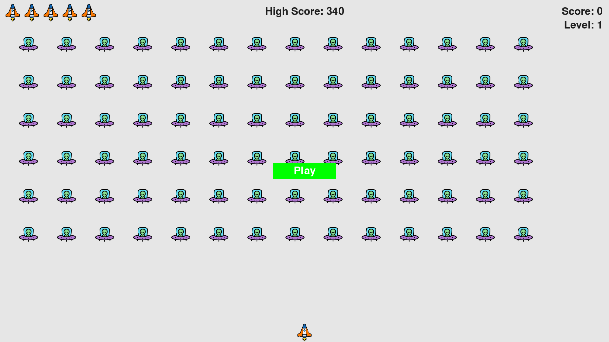

# 👽 Alien Invasion 🚀

A classic arcade-style **Python + Pygame** space shooter where you dodge alien fleets, shoot enemies, and try to set the highest score!

This game is my **first complete Python project**
---

## 📸 Screenshot



---

## 🎮 Features

- 🛸 Alien fleets that increase in speed and difficulty  
- 🔫 Bullet shooting with collision detection  
- 🧠 High score tracking saved across sessions (`hs.txt`)  
- 🔄 Lives, levels, and restart logic  
- 🎯 Responsive controls and game loop  

---

## 🛠 Tech Stack

- **Python 3.x**  
- **Pygame**  
- Built in **Visual Studio Code**  

---

## 💻 Installation

### 1. Clone the Repository

```bash
git clone https://github.com/Demanics/alien-invasion.git
cd alien-invasion
python alien_invasion.py

👤 Author
🧑‍💻 @Demanics

🏅 Badges


📜 License
This project is licensed under the MIT License — feel free to fork and modify for personal or educational use.

✍️ Acknowledgments
📘 Book Reference: Python Crash Course by Eric Matthes
Game logic and structure heavily inspired by Chapter 14–17 of this book.

🎨 Assets:
Icons and sprites are from Flaticon, used under their free-use and educational attribution model.

This project is created purely for learning and educational demonstration.

🚀 If this helped or inspired you, give it a ⭐ on GitHub
